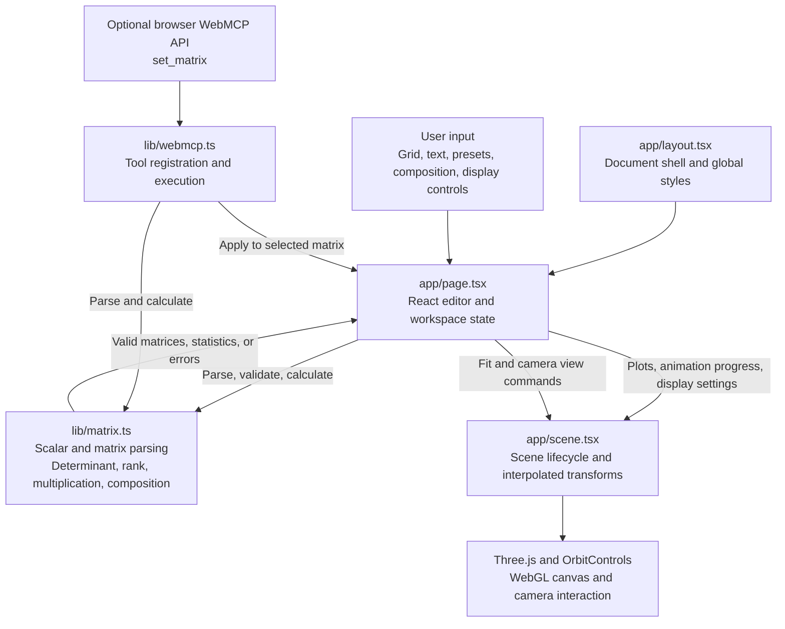

# Matrix Space

An interactive 3D linear algebra playground built with React, TypeScript, Three.js, and Vinext.

## Run

```sh
npm install
npm run dev
```

## Validate

```sh
npx tsc --noEmit
node --experimental-strip-types --test lib/matrix.test.ts
npm run build
```

## Deploy to Vercel

Push this repository to GitHub and import it into Vercel with the repository root as the Root Directory. The checked-in `vercel.json` selects the Other framework preset, installs dependencies with `npm ci`, and runs `npm run build:vercel`.

Vinext uses Nitro's Vercel adapter to generate `.vercel/output`, including the server function, static assets, and routing configuration. This replaces the previous Cloudflare Workers build. No application environment variables are required.

For an existing Vercel project, push these changes and redeploy the new commit. The repository configuration overrides the framework, build command, and output directory settings. If the project previously used a subdirectory as its Root Directory, change it to the repository root.

You can verify the deployment build locally with `npm run build:vercel`. For a local production server, run `npm run build` followed by `npm start`; the normal build creates `.output/server/index.mjs`.

## Multiple matrices

Use **Add matrix** to create another 3×3 matrix. Select a row to edit it; each matrix retains its own input, color, visibility, and validation state. Rename a matrix with a unique identifier, and use its visibility button or remove button to manage overlays. The last matrix cannot be removed.

Enable **Plot a composition** to evaluate products such as `A * B` (B acts first). The white result updates when operands change. Renaming updates expression references; deleting an operand shows an error and removes the result until the expression is corrected. Hidden matrices remain valid operands. The scrubber animates all plotted matrices together, and Fit frames all visible transformations.

## Input and conventions

The current workspace accepts 3×3 real matrices. Matrix columns are basis vectors; points transform as column vectors `Ax`. Grid cells support arithmetic, fractions, `pi`, and `sqrt()`. Text mode accepts `[1 0 0; 0 1 0; 0 0 1]`, nested arrays, or pasted spreadsheet rows. Expressions in text mode must not contain spaces internally. Values are limited to ±10,000. Invalid edits retain the last valid visualization.

The scrubber uses linear interpolation `(1-t)I+tA`, which does not preserve rotations and may pass through singular matrices. Statistics describe the selected target matrix. Rank uses relative numerical tolerance 1e-10. Fit reframes large transformations. Rendering is on demand; resources are reused and disposed on unmount.

An optional feature-detected WebMCP `set_matrix` tool uses the same editor state. No supported browser WebMCP validation context was available during implementation, so browser registration remains unverified.

## Architecture

The React page owns the matrix workspace and display settings. The shared math module validates input and computes matrix statistics and compositions; the scene receives the resulting plots and renders them in the browser. The optional WebMCP tool updates the same selected matrix through the page's apply callback.


